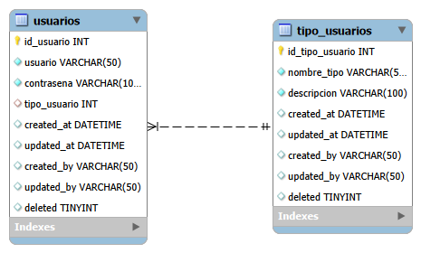

# Sistema de Gestion de Usuarios

Este proyecto es una aplicacion de consola desarrollada en Python que sirve como ejercicio de repaso para aprender a conectar una base de datos MySQL con el lenguaje de programacion, utilizando el paradigma de Programacion Orientada a Objetos. Es una practica previa para entender la logica de persistencia de datos y control de accesos antes de avanzar hacia el desarrollo web con Flask.

## Descripcion del proyecto

El programa simula un sistema de autenticacion que valida las credenciales introducidas por consola. Dependiendo del tipo de usuario registrado en la base de datos, el sistema restringe las opciones del menu:

* **Administrador (ADMIN):** Tiene acceso completo para realizar las operaciones CRUD basicas. Puede registrar nuevos usuarios, buscar por ID, listar a todos los registrados, modificar el tipo de usuario y dar de baja registros.
* **Usuario Comun (USER):** Tiene un acceso limitado. Al iniciar sesion solo ve sus datos de perfil y la opcion de cerrar sesion para volver al menu principal.

Para practicar buenas costumbres de bases de datos, el proyecto implementa un borrado logico (soft delete) en lugar de una eliminacion fisica, usando una columna en la tabla para marcar si el registro esta activo o no.

## Tecnologias utilizadas

* Python como lenguaje base.
* MySQL como motor de base de datos relacional.
* mysql.connector como la libreria encargada de conectar Python con el servidor MySQL.
* Programacion Orientada a Objetos para organizar el codigo en clases separadas (Conexion, Usuario y el flujo principal).

## Requisitos de instalacion y ejecucion

### 1. Instalacion de dependencias
Es necesario tener Python y un servidor local de MySQL (como XAMPP, Workbench o similar). La libreria de conexion se instala desde la terminal con el siguiente comando:

```bash
pip install mysql-connector-python
```

### 2. Configuracion de la base de datos
Desde tu gestor de bases de datos, debes ejecutar el archivo crear_bd.sql que esta en la carpeta de recursos. Este script creara la base de datos usuarios_db y la tabla correspondiente.

### 3. Ejecucion
Revisa que los datos de conexion (host, user, password) en el archivo conexion.py coincidan con los de tu MySQL local. Despues, ejecuta el programa desde la terminal con:

```bash
python main.py
```

## Control de permisos y funciones

### Opciones de Administrador
El menu corre dentro de un ciclo while que permite:
1. Registrar usuario: Pide nombre, clave y tipo de usuario (ADMIN o USER) para guardarlo.
2. Listar usuarios: Muestra una tabla con los IDs, nombres y roles de los usuarios activos.
3. Buscar usuario: Pide un ID y trae su informacion.
4. Modificar usuario: Permite cambiar los datos y el rol de un usuario existente.
5. Eliminar usuario: Cambia el estado del usuario a inactivo tras pedir una confirmacion.

### Opciones de Usuario Comun
El menu para el rol comun bloquea todas las funciones de modificacion. Solo muestra el nombre del usuario, su tipo y la opcion de cerrar sesion para limpiar las variables de control y regresar al menu de inicio.

## Diagrama de la base de datos
El esquema de la tabla y sus columnas se encuentra en el archivo ERD.png dentro de la carpeta docs.



---

## Nota del desarrollador

Se presenta una disculpa debido a que la estructura de la base de datos y la insercion de los datos de prueba se dejaron juntas en el mismo archivo, en lugar de separarse en crear_bd.sql y poblar_datos.sql. Esto ocurrio por falta de tiempo al momento de organizar la entrega y por no haber visto a detalle esa indicacion en el documento de pautas. El proyecto funciona y carga exactamente igual.
